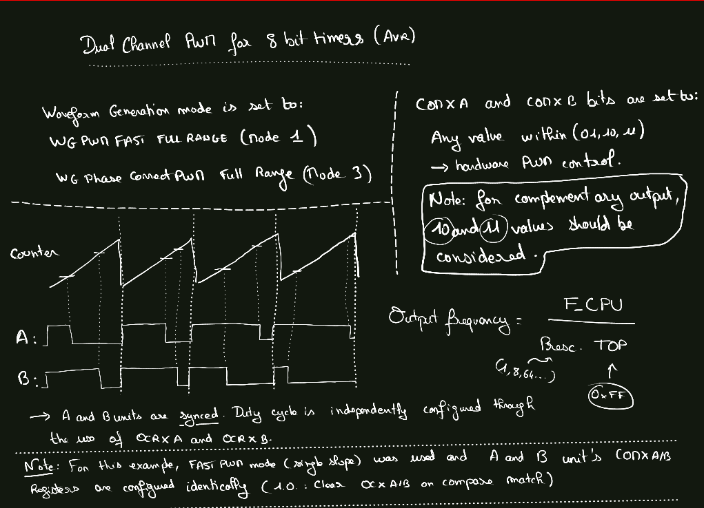
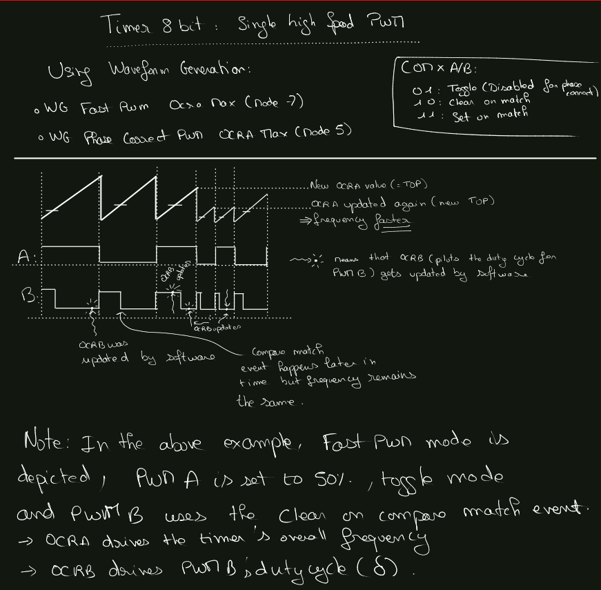

# Index
- [Index](#index)
- [PWM driver](#pwm-driver)
- [Driving 8 bit timers](#driving-8-bit-timers)
  - [Dual channel PWM configuration](#dual-channel-pwm-configuration)
  - [Single channel, high speed PWM configuration](#single-channel-high-speed-pwm-configuration)

# PWM driver
This PWM driver builds upon the various timer driver found in the AvrAsyncCore SDK.
It basically provides a frontend which abstract some inner mechanisms of the timer themselves, trying to make its interface more generic and more
portable across the Avr family.

# Driving 8 bit timers
Regular 8 bit timers and 8 bit asynchronous timers share a common peripheral interface, where one can choose how configure them as PWM units.
As per the other kinds of timers, they have two units, A and B, which are sharing a common counter register (usually TCNTx).

> Note : as both 8 regular 8 bit timer and 8 bit asynchronous timer share a very similar architecture, following aspects and code snippets can apply to both of them.
> Their specific implementation can be found in their `timer_8_bit{...}_reg.h` header file which encodes all available enum types.

Timer configuration is performed through the correct use of their `waveform generation` bits, located within the `TCCRxA` and `TCCRxB` registers.
However, one might note that the available `Waveform Generation` bits combinations state that the TOP value of the counters can either be `0xFF` or `OCRxA`.
Those Waveform Generation configurations are depicted in [timer_8_bit_reg.h](../../Drivers/Timers/Timer_8_bit/inc/timer_8_bit_reg.h) and [timer_8_bit__async_reg.h](../../
Drivers/Timers/Timer_8_bit_async/inc/timer_8_bit_async.h) header files like so :

```C
/**
 * @brief Describes 8 bits timers waveform generation modes
*/
typedef enum
{                                                      /**< |   Mode of operation       |   TOP   |  Update of OCRx at |  TOV Flag set on |*/
    TIMER8BIT_WG_NORMAL                         = 0U,  /**< | Normal operation mode     |   0xFF  |       Immediate    |      MAX         |*/
/* --------------------------------------------------------------------------------------------------------------------------------------- */
    TIMER8BIT_WG_PWM_FAST_FULL_RANGE            = 3U,  /**< | Fast PWM                  |   0xFF  |       BOTTOM       |      MAX         |*/
    TIMER8BIT_WG_PWM_FAST_OCRA_MAX              = 7U,  /**< | Fast PWM                  |   OCRA  |       BOTTOM       |      MAX         |*/
/* --------------------------------------------------------------------------------------------------------------------------------------- */
    TIMER8BIT_WG_PWM_PHASE_CORRECT_FULL_RANGE   = 1U,  /**< | PWM, phase correct        |   0xFF  |       TOP          |      BOTTOM      |*/
    TIMER8BIT_WG_PWM_PHASE_CORRECT_OCRA_MAX     = 5U,  /**< | PWM, phase correct        |   OCRA  |       TOP          |      BOTTOM      |*/
/* --------------------------------------------------------------------------------------------------------------------------------------- */
    TIMER8BIT_WG_CTC                            = 2U,  /**< | Clear Timer Compare match |   OCRA  |       Immediate    |      MAX         |*/
} timer_8_bit_waveform_generation_t;
```
So as we can see, both fast and phase correct PWM modes alternatively use `OCRA` and `0xFF` as TOP values (autoreload trigger) by the timer peripheral.
This implies that regarding PWM modes, we have essentially two available solutions in order to generate a pure hardware PWM signal :
* Dual channel configuration with almost no control over the frequency, and full control over duty_cyle
* Single channel, high speed PWM with full frequency and duty cycle control

## Dual channel PWM configuration
This configuration is achieved when either `TIMER8BIT_WG_PWM_FAST_FULL_RANGE` or `TIMER8BIT_WG_PWM_PHASE_CORRECT_FULL_RANGE` is used to configure a given timer.
As a result, the top value of the counter is always set to the maximum value of the 8 bit counter, which is `0xFF`.
Then, the only way to change the frequency of the output PWMs will be to change the prescaler used by the timer itself, or by varying the CPU frequency as the output frequency is governed by the following equation :

$$\dfrac{F\_CPU}{Prescaler \times TOP}$$

Hence, for a CPU frequency of, say 16 MHz it gives the following table:
| Prescaler             |   1   |   8  |  64 | 256 | 1024 |
|-----------------------|-------|------|-----|-----|------|
| output frequency (Hz) | 62500 | 7812 | 976 | 244 |  61  |

So if we want a slow PWM, this is perfectly suitable and we can even setup a complementary output PWM with this kind of configuration, with dead-time generation and and the good stuff.

For high speed PWM however, this is really limiting and the fact that we cannot choose an output frequency apart from the one listed above is really the main limiting factor.



## Single channel, high speed PWM configuration
This configuration sacrifices the unit A of the timer, as it its OCRA value is used by the timer to determine the `TOP` value.
It is achieved through the use of `TIMER8BIT_WG_PWM_FAST_OCRA_MAX` or `TIMER8BIT_WG_PWM_PHASE_CORRECT_OCRA_MAX` and correctly handling `COMAxx` and `COMBxx` registers.
Hence, the B unit will benefit from the `OCRA` value in order to pinpoint the closest frequency we want to work with, and the `OCRB` value will then be used to set the `duty_cycle` of the B unit.

At best, the A PWM channel can output a 50% duty_cycle PWM with half the frequency of B unit's if setup as a pin toggle event (`TIMER8BIT_CMOD_TOGGLE_OCnX`).
* Using `TIMER8BIT_CMOD_CLEAR_OCnX` will pull the output pin up to VCC permanently (pin is set to HIGH when timer reaches the BOTTOM value = 0)
* Using `TIMER8BIT_CMOD_SET_OCnX` will pull the output pin down to GND permanently (pin is cleared when timer reaches the BOTTOM value = 0)


